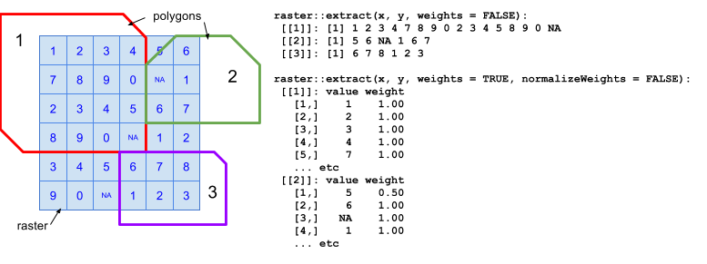

```{r setup, echo = FALSE, message = FALSE}
library(rgdal) ### note: also loads sp package as a dependency
library(rgeos)
library(raster)
library(maptools)

library(dplyr)
library(tidyr)
library(stringr)
```


This tutorial/workshop assumes that you have existing vector spatial data that you want to analyze.  You can create polygons and such directly in R, but we will save that for another time...

# Reading shapefiles

Here are two different ways to read in spatial vector data, each with advantages and disadvantages:

### reading shapefiles using `rgdal::readOGR()`

```{r read shapefiles 1}

dir_spatial   <- 'spatial_data'
layer_bc <- 'ohibc_rgn_simple'

poly_bc_rgn <- readOGR(dsn = dir_spatial, layer = layer_bc, stringsAsFactors = FALSE)

### you can easily plot polygons, though complex polys take a while
plot(poly_bc_rgn, col = 'light blue', border = 'blue')
```

* `dsn` is the data source name.  It can be a .gdb or a directory with shapefiles in it.  It can be relative or absolute file path.
    * `dsn` is not a fan of `~` as a shortcut for home directory, e.g. `dsn = '~/github/ohiprep`.
    * To get around this, one option is to use `path.expand()`, e.g. `dsn = path.expand('~/github/ohiprep')`
* `layer` is the layer name.  
    * If you're reading from a .gdb, you can tell it which layer to pull out of that .gdb 
        * `ogrListLayers()` can help identify the layers within the .gdb if you're not sure.
    * If you're reading a .shp (and the associated .dbf etc), then `layer` should be the base name of the shapefile (without the .shp extension).  E.g. if you want `rgn_all_mol_med_res.shp`, then `layer = 'rgn_all_mol_low_res'`.
* `p4s` allows you to input a proj.4 string to indicate projection information (CRS - coordinate reference system).  If there's already a .prj file associated with this layer, `readOGR()` will automatically read it in.

Quick aside on projections and coordinate reference systems:

* WGS 84: lat and long in degrees.  A basic projection, very common to see esp for global data.  Not great for rasters in spatial analysis, since each cell will contain a different amount of area depending on your latitude.
    * EPSG:4326 WGS 84
    * proj.4 string: `'+proj=longlat +datum=WGS84 +no_defs +ellps=WGS84 +towgs84=0,0,0'`
* Mollweide: equal area projection, units in meters.  Works well for global datasets; looks like a map though the edges get distorted.  Equal area projections work well in conjunction with rasters - each cell will contain the same amount of area.
    * EPSG:54009
    * proj.4 string: `'+proj=moll +lon_0=0 +x_0=0 +y_0=0 +datum=WGS84 +units=m +no_defs'`
* BC Albers: equal area projection (so it's good for rasters), units in meters.  Albers projections are often used for smaller regions, each with its own version.  British Columbia's official projection is BC Albers, which is what we will be using today (mostly).
    * EPSG:3005 - NAD83 / BC Albers
    * proj.4 string: `'+proj=aea +lat_1=50 +lat_2=58.5 +lat_0=45 +lon_0=-126 +x_0=1000000 +y_0=0 +datum=NAD83 +units=m +no_defs +ellps=GRS80 +towgs84=0,0,0'`

### reading shapefiles using `maptools::readShapePoly()`

```{r read shapefiles 2, echo = TRUE, eval = TRUE}
shp_bc <- file.path(dir_spatial, layer_bc)
p4s_bc <- CRS('+proj=aea +lat_1=50 +lat_2=58.5 +lat_0=45 +lon_0=-126 +x_0=1000000 +y_0=0 +datum=NAD83 +units=m +no_defs +ellps=GRS80 +towgs84=0,0,0')

poly_bc_rgn <- readShapePoly(fn = shp_bc, proj4string = p4s_bc)

plot(poly_bc_rgn, col = 'light blue', border = 'blue')

```

* `fn` is the full filename, leaving off the .shp extension.  This has to be a shapefile (not a .gdb).
* `proj4string` is an optional proj.4 CRS designation.  
    * `readShapePoly()` does not read .prj files, so it will not know the projection unless you manually tell it.  
    * This argument has to be a CRS object, so for example, if you want to set Mollweide you would use: `proj4string = CRS('+proj=moll +lon_0=0 +x_0=0 +y_0=0 +datum=WGS84 +units=m +no_defs')`
    
### `readOGR()` vs `readShapePoly()`

* `readOGR()` and `readShapePoly()` (and its cousins `readShapeLines()`, `readShapePoints()`, etc) also have analogous `write` functions.
* `readShapePoly()` seems to be significantly faster than `readOGR()` for big shapefiles.
* `readShapePoly()` doesn't work on .gdb, which `readOGR()` can do.  
    * One note, learned the annoying painful way, is that if you wish to read layers from a geodatabase (.gdb), you need to have GDAL version 1.11 or higher installed on your computer (outside of R).  In that version, they included the driver for the OpenFileGDB file format.  As of this writing, Neptune's GDAL version is only 1.10, though hopefully it will be updated soon, when the OS etc is updated.
* `readShapePoly()` doesn't automatically read in CRS info from a .prj file; you have to manually provide the coordinate reference system.
* I prefer to stick with `readOGR()` where possible (especially for smaller files), to automatically use projection/CRS information where it is available.


# Understanding spatial polygon objects in R

Once the shapefile is read in, it becomes a SpatialPolygonsDataFrame object (from the `sp` package).  SpatialPolygonsDataFrame store shape info and attributes in different slots, with a structure like this:

* `SpatialPolygonsDataFrame` (top level structure)
    * `@data`: a dataframe that holds the attribute table; each row correlates with a polygon in the `polygons` slot.
    * `@polygons`: a list of Polygons-class objects, each with their own bits and pieces.  Each item in the list is a complete polygon feature, made up of sub-polygons; and each item in the list corresponds with a row in the dataframe in the `data` slot.
    * `@plotOrder`: a vector of integers showing which order to plot the `polygons` list
    * `@bbox`: info on the bounding coordinates (x & y min & max).
    * `@proj4string`: a CRS object that contains projection or coordinate system info
    


Each of these slots can be accessed by a `@` symbol (rather than a `$` symbol).  If your SpatialPolygonsDataFrame is called `x`, then you can access the attribute table by calling `x@data` and treat it exactly like a regular data frame (though be wary of operations that might change the order or length of the data frame - confusion and chaos will reign!)

```{r viewing SpatialPolygonsDataFrame slots, echo = TRUE, eval = TRUE}
### view the overall structure
summary(poly_bc_rgn)
# str(poly_bc_rgn, max.level = 3) ### view object structure, similar to summary

### list the slots for this S4 object
slotNames(poly_bc_rgn)

### check out the attribute table in the data slot
head(poly_bc_rgn@data)

### check out the basics of the polygon features
summary(poly_bc_rgn@polygons)  ### summary of the polygon features
# str(poly_bc_rgn@polygons, max.level = 3)

### inspect one of the smaller sub-polys that make up the first polygon
### feature; this one draws a small hole in the main polygon
poly_bc_rgn@polygons[[1]]@Polygons[[2]] 

### check out the CRS info
poly_bc_rgn@proj4string
```

You can also manipulate these slots individually, for example filtering out rows of the dataframe in the `data` slot, but you will also need to treat the other slots accordingly.

# Working with data in polygon objects

## Adding data to polygons

If you'd like to add a column of data to the SpatialPolygonsDataFrame, for example harvest tonnes or a region ID value, you should be able to simply access the `data` slot and treat it like a data frame.

NOTE: When accessing the `@data` slot, keep in mind that all of the polygon information is in the `@polygons` slot - and the order of rows in `@data` needs to stay matched up with the order of the list in `@polygons`.  Changing the order of rows (or adding/deleting rows) in `@data` DOES NOT make analogous changes to `@polygons`... and chaos ensues.

```{r adding data to SpatialPolygonsDataFrame, echo = TRUE, eval = TRUE}
### create a data frame of harvest per region.  Note not all regions are represented here!
harv_data <- data.frame(rgn_id   = c(  1,  2,  3,  5,  8),
                        h_tonnes = c(105, 89, 74, 21, 11))

### use left_join to join data to attributes table without changing order
poly_bc_rgn@data <- poly_bc_rgn@data %>%
  left_join(harv_data, by = 'rgn_id')

### note unassigned regions have NA for harvest tonnage
poly_bc_rgn@data
```

You should also be able to use `dplyr`- and `tidyr`-type functions like `mutate()` and `group_by()` (since `group_by()` doesn't reorder the rows); just be careful of things like `filter()`, `arrange()`, `summarize()`, and `full_join()` that might reorder or add or delete rows.

``` {r}
poly_bc_rgn@data <- poly_bc_rgn@data %>%
  mutate(
    h_kg   = h_tonnes * 1000,
    h_tot  = sum(h_tonnes, na.rm = TRUE),
    h_prop = round(h_tonnes/h_tot, 3))

poly_bc_rgn@data
```


## Selecting or filtering polygons based on attributes

Use indexing to select just rows where there is harvest data.  This eliminates the polygons as well as the attribute table rows, and resets the plot order.  Probably safer than filtering on the data slot directly...

```{r selecting/filtering by attribute, echo = TRUE, eval = TRUE}
### Select only regions with non-NA harvest values
poly_bc_harvest <- poly_bc_rgn[!is.na(poly_bc_rgn@data$h_tonnes), ]

### or use base::subset (but not dplyr::filter)
poly_bc_harvest <- poly_bc_rgn %>% subset(!is.na(h_tonnes))

poly_bc_harvest@data

plot(poly_bc_rgn,     col = rgb(.7, .7, 1),      border = rgb(0, 0, 1))
plot(poly_bc_harvest, col = rgb(.7, .3, .3, .5), border = rgb(1, 0, 0, .5), add = TRUE)
```

fun fact: the `rgb()` function allows you to specify color by Red/Green/Blue proportions (0 to 1), but also allows a fourth argument for 'alpha' (opacity) to create semi-transparent layers.  There are also similar `hsv()` and `hcl()` functions if you are a graphics nerd and prefer to specify hue/saturation/value or hue/chroma/luminance...

# Fixing projections

Mismatched coordinate reference systems are just as much a pain in R as they are in ArcGIS or QGIS.  But they're easy to work with once you know how to inspect them and re-project them.

```{r fixing projections, echo = TRUE, eval = TRUE}
### Load and plot the MPA map on top of the regions
poly_bc_mpa <- readOGR(dsn = dir_spatial, layer = 'mpa_bc_simple')

plot(poly_bc_rgn, col = rgb(.7, .7, 1), border = rgb(0, 0, 1))
plot(poly_bc_mpa, col = rgb(1, .5, .5, .5), border = rgb(1, 0, 0, .5), add = TRUE)
```

Note that the MPA polys don't show up on the map!  That's because of a CRS error...

``` {r}
poly_bc_mpa@proj4string 
```

This layer's CRS is WGS84, but the BC regions map is in BC Albers projection.

If the proj4string had been NA (e.g. if we had used `readShapePoly()` and not specified a CRS), we could manually set the projection by accessing the `@proj4string` slot:
* `poly_bc_mpa@proj4string <- CRS('+proj=longlat +datum=WGS84 +no_defs +ellps=WGS84 +towgs84=0,0,0')`

Reprojecting to a new CRS is not as simple as just assigning a new CRS to the `@proj4string` slot though... instead, we can use the `rgdal::spTransform()` function.

``` {r}
poly_bc_mpa <- spTransform(poly_bc_mpa, p4s_bc)
poly_bc_mpa@proj4string
poly_bc_rgn@proj4string  ### OK, now they match!

plot(poly_bc_rgn, col = rgb(.7, .7, 1), border = rgb(0, 0, 1))
plot(poly_bc_mpa, col = rgb(1, .5, .5, .5), border = rgb(1, .3, .3, .8), add = TRUE)
  ### The semi-transparency not only looks awesome, but also
  ### allows us to see whether there are any overlapping polygons!
```

Note that transforming projections might introduce geometry errors in a previously error-free Spatial object... for notes on checking and fixing this, see the appendix.

# Geoprocessing tools

The `rgeos` package has many of the standard geoprocessing tools available, for example: `gArea()`, `gDifference()`, `gIntersection()`, `gBuffer()`... and the `raster` package builds further upon some of these.  For example, `rgeos::gIntersection()` and `raster::intersect()` both return polygon entities but `gIntersection()` drops the data frames (apparently on purpose...?)

Let's apply those to our polygon layers, in order to find how much of the coastline is protected by marine protected areas.  Here's what we'll try:

* Create a near-shore MPA layer by intersecting (`raster::intersect()`) the MPA layer with the 3 nautical mile offshore layer
* Find the total area (`rgeos::gArea()`) of the near-shore ocean, from the coastline out to 3 nautical miles, for each of BC's regions.
* Find the area of MPAs within 3 nm, and divide it by the total near-shore area.

``` {r}
### Load in the 3 nm buffer layer
poly_bc_3nm <- readShapePoly(fn = file.path(dir_spatial, 'ohibc_offshore_3nm_simple'), proj4string = p4s_bc)

### plot regions, mpa layer, and 3 nm regions
plot(poly_bc_rgn, col = rgb(.7, .7, 1), border = rgb(0, 0, 1))
plot(poly_bc_mpa, col = rgb(1, .5, .5, .5), border = rgb(1, .3, .3, .8), add = TRUE)
plot(poly_bc_3nm, col = rgb(.5, 1, .5, .5), border = rgb(.3, 1, .3, .8), add = TRUE)

### Intersect the MPA layer with the 3 nm regions layer
poly_bc_3nm_mpa <- raster::intersect(poly_bc_mpa, poly_bc_3nm)

### plot the new intersected layer
plot(poly_bc_3nm_mpa, col = rgb(1, 1, .5, .5), border = rgb(1, 1, .3, .7), add = TRUE)

### Calculate area of protected areas and coastal regions, and attach to polygons
poly_bc_3nm_mpa@data$area_km2 <- gArea(poly_bc_3nm_mpa, byid = TRUE) / 1e6
poly_bc_3nm@data$area_km2 <- gArea(poly_bc_3nm, byid = TRUE) / 1e6

### Summarize the total protected area within each region
prot_area_df <- poly_bc_3nm_mpa@data %>%
  group_by(rgn_id, rgn_name, rgn_code) %>%
  summarize(prot_area_km2 = sum(area_km2)) %>%
  left_join(poly_bc_3nm@data %>% 
              select(rgn_id, tot_area_km2 = area_km2),
            by = 'rgn_id') %>%
  mutate(prot_area_pct = round(prot_area_km2 / tot_area_km2, 3) * 100)

# pretty static table
knitr::kable(prot_area_df)
# or interactive table
DT::datatable(prot_area_df)
```

# Rasters and polygons

Extracting raster data into regions defined by a SpatialPolygons* object is pretty easy, using the `extract()` function from the `raster` package.  In next few code chunks we'll repeat the analysis from above, to identify the percent of BC's near-shore ocean that is protected by MPAs, using rasters.

While it is possible to use vector geoprocessing to figure this out, overlapping polygons could be double-counted, so this time I will instead rasterize the MPA polygons, prioritizing the earliest date of protection, then we'll tally up the protected area and total area.  First step - establish a base raster.

## Creating a raster from scratch

We will use the extents of the `poly_bc_rgn` to set raster extents and then round to nearest 10 km.  There are a couple of ways we can find the extents of the layer: `raster::extent()` or just access the `@bbox` slot of the SpatialPolygonsDataFrame object.

Resolution note: since we're trying to analyze protected areas within a 3-nm-wide feature, our resolution should be AT MOST half the size of that feature, or 1.5 nm.

* 3 nautical miles is about 5556 meters.  So max cell size would be about 2750 meters.
* Smaller raster cells = more accurate results, but slower.  Let's go with 2500 m cells for speed.
* If you have a fast computer, feel free to set the resolution smaller (e.g. 1 km) and see how the results compare.
* For OHI, we have been using 500 meter cells on a global scale.  It takes a while...

```{r set up base raster, echo = TRUE, eval = TRUE}
ext <- extent(poly_bc_rgn); ext
ext1 <- poly_bc_rgn@bbox; ext1

ext@xmin <- round(ext@xmin - 5000, -4); ext@ymin <- round(ext@ymin - 5000, -4)
### expand the extents out to round 10 km edges
ext@xmax <- round(ext@xmax + 5000, -4); ext@ymax <- round(ext@ymax + 5000, -4)
### if using the @bbox option, use ext1['x', 'min'] and such

reso <- 2500 ### BC Albers uses meters as units, set resolution to a 2.5-km grid
xcol <- (ext@xmax - ext@xmin)/reso ### determine # of columns from extents and resolution
yrow <- (ext@ymax - ext@ymin)/reso ### determine # of rows

rast_base <- raster(ext, yrow, xcol, crs = p4s_bc)

rast_base ### inspect it: resolution and extents are nice and clean
```

## Rasterize polygons

Next step: rasterize the MPA polygons.  See later in the doc for info on `gdalUtils::gdal_rasterize()` as an alternative to `raster::rasterize()` that is way faster, avoids some odd problems, but has some arcane arguments and a fairly important limitation.  `raster::rasterize()` is probably your best bet in general.

In this case, we will rasterize the MPA polygons using the `rast_base` raster to set extents and cell size.  The cells will get the value of the `STATUS_YR` attribute (the year in which the MPA was designated); for overlapping MPAs, the earliest year ('min') will be used.

```{r rasterize MPA polygons, echo = TRUE, eval = TRUE}
rast_bc_mpa <- rasterize(poly_bc_mpa, rast_base, field = 'STATUS_YR', fun = 'min')
```

Note that the `raster` package also contains functions for `rasterToPolygons()`, `rasterToPoints()`, etc. to turn rasters into vector spatial objects.

## The gloriousness of `raster::extract()`

Now the big step: `raster::extract()`.  Basically we will overlay a set of region polygons on top of our raster, and group the cells by which region they fall into.  For cells that overlap the border between multiple regions, it will even tell us how much of the cell falls into each region (if we set `weights = TRUE`), but this is very slow...



Note that `extract()` is also a function in the `tidyr` package and elsewhere; so I generally force the issue by calling `raster::extract()` just to make sure.

The basic arguments are simply the raster with the interesting data, and the polygon features that define the regions of interest.  There are other arguments, but one set of arguments that may be interesting is `weights` and/or `normalizeWeights`.

* `weights` (logical): if `weights = TRUE`, provides info on how much of a cell was covered by the polygon in question.
* `normalizeWeights`  (logical): if `normalizeWeights = TRUE` then the reported weights will be normalized for each polygon, so the total for each polygon adds up to 1.00.  If you just want the fraction of cell coverage for each cell, set `normalizeWeights = FALSE`.

It's a bit processor-intensive so be patient...

```{r raster::extract(), echo = TRUE, eval = TRUE}
### plot the MPA raster with the 3 nm regions on top, just to see
plot(poly_bc_rgn, col = rgb(.7, .7, 1, .5), border = NA)
plot(rast_bc_mpa, add = TRUE)
plot(poly_bc_3nm, col = rgb(1, .5, .5, .5), border = NA, add = TRUE)

### Extract the MPA raster cells by region
mpa_by_rgn <- raster::extract(rast_bc_mpa, poly_bc_3nm, weights = FALSE)

# mpa_by_rgn_weights <- raster::extract(rast_bc_mpa, poly_bc_3nm, weights = TRUE, normalizeWeights = FALSE)
```

### Turning `raster::extract()` output into something useful

`raster::extract()` returns a list of vectors; each list item is a vector of all the cell values contained within one of the polygon features (`poly_bc_3nm@polygons`).  At this point, we need to assign a non-generic name to our list items so we can keep track.  The following line names the list items according to the `rgn_id` column in the attribute table contained in `poly_bc_3nm@data` (this works since the list is in order of items in the `@polygons` slot, which is the same order of attributes in the `@data` slot).

```{r name list elements from raster::extract, echo = TRUE, eval = TRUE}
names(mpa_by_rgn) <- poly_bc_3nm@data$rgn_id

# names(mpa_by_rgn_weights) <- poly_bc_3nm@data$rgn_id
```

To get the data out of annoying list form and into convenient data frame form, this next code chunk does the following:

* create an empty data frame (`mpa_rgn_df`) that we will build up as we unlist each list item.
* loop over each of the list items (named after the `rgn_id`s in the previous step)
    * create a temporary data frame that stores the `rgn_id` (from loop index) and the entire list of cell values for that particular `rgn_id`
    * tack that temp data frame onto the bottom of the existing `data_rgn_df` (first time through, tacks onto an empty data frame)

Voilà! a data frame of cell values by region.

```{r convert list elements to data frame, echo = TRUE, eval = TRUE}
### For the dataframe without cell weights, each list is just a
### vector of values, so we can simply assign that to a column in
### the data frame.
mpa_rgn_df <- data.frame()
for (rgn_id in names(mpa_by_rgn)) {
  temp_df <- data.frame(rgn_id = as.numeric(rgn_id), year = unlist(mpa_by_rgn[[rgn_id]]))
  mpa_rgn_df <- rbind(mpa_rgn_df, temp_df)
}

### for the dataframe with cell weights, each list item is a 
### matrix containing value & weight, so we can unlist it into a temp
### matrix and then assign each variable separately.  
# mpa_rgn_weights_df <- data.frame()
# for (rgn_id in names(mpa_by_rgn_weights)) {
#   temp_matrix <- unlist(mpa_by_rgn_weights[[rgn_id]])
#   temp_df <- data.frame(rgn_id, year = temp_matrix$value, wt = temp_matrix$weight)
#   mpa_rgn_df <- rbind(mpa_rgn_weights_df, temp_df)
# }
```

Now we can use that data frame like any regular data frame.  Let's find out how many cells in each region, and how many of those cells are protected by MPAs.  We'll ignore the year for now; any cell with a non-NA will count as protected.

``` {r}
prot_area_df2 <- mpa_rgn_df %>%
  group_by(rgn_id) %>%
  summarize(cells_mpa     = sum(!is.na(year)),
            cells_tot     = n(),
            prot_area_pct = round(cells_mpa/cells_tot, 3) * 100) %>%
  left_join(poly_bc_rgn@data %>%
              select(rgn_id, rgn_name),
            by = 'rgn_id')

prot_area_df <- prot_area_df %>%
  rename(prot_pct_vec = prot_area_pct) %>%
  left_join(prot_area_df2 %>%
              select(rgn_id, prot_pct_rast = prot_area_pct))

knitr::kable(prot_area_df)
```

Note the small differences in the protected area percent, depending on whether raster or vector method was used.  

-----

# Further examples

To see much of this stuff put into action, check out [OHIBC LSP script](https://github.com/OHI-Science/ohibc/blob/master/lsp/data_prep_lsp.R) and its [associated functions](https://github.com/OHI-Science/ohibc/blob/master/lsp/R/lsp_fxns.R).

For a more complex version that maintains the spatial distribution of the data, check out [OHI global 2015 SPP_ICO goal script](https://github.com/OHI-Science/ohiprep/blob/master/globalprep/SPP_ICO/data_prep_SPP.R) and its [associated functions](https://github.com/OHI-Science/ohiprep/blob/master/globalprep/SPP_ICO/R/spp_fxn.R).  In these scripts, a raster of cell IDs is extracted against polygons for many different species; the resulting lists tell which cell IDs contain which species.

This [downres_polygons.R script](https://github.com/OHI-Science/ohiprep/blob/master/globalprep/spatial/downres_polygons.R) was used to simplify the high resolution global polygon shapefiles (308 MB of polygon fun) into [lower resolution files](https://github.com/OHI-Science/ohiprep/tree/master/globalprep/spatial/downres) (.7 MB and 11 MB versions) for quicker plotting.  While the script itself may not be all that useful to you, there are plenty of examples of digging into and manipulating the details of SpatialPolygonsDataFrame objects.  The script first examines each polygon feature, and strips out sub-polygons whose area falls below a certain threshold; then it simplifies the geometry of the remaining polygons using a [Douglas-Peuker algorithm](https://en.wikipedia.org/wiki/Ramer%E2%80%93Douglas%E2%80%93Peucker_algorithm).

# Appendix

## Alt method of rasterizing polygons

Most of what you need to know about rasters is covered in Jamie's spatial data workshop.  One added point: an alternative method of rasterizing vector data, when `raster::rasterize()` is causing problems.

Note that one major issue with `gdal_rasterize()` (aside from the arcane argument list) is that in the event of overlapping polygons, there's no place for a decision rule as to which polygon value gets assigned to the cell.  If you know there are no overlaps, then this is a very fast and seemingly accurate option.

```
library(gdalUtils)
rast_3nm_gdal <- gdal_rasterize(
    src_datasource = file.path(dir_spatial, 'ohibc_offshore_3nm.shp'),
      # src_datasource needs to be an OGR readable format (e.g. .shp)
      # NOTE: doesn't need source to already be in memory!
    dst_filename = file.path(dir_spatial, 'rast_3nm_gdal.tif'), 
      # destination for output
    a = 'rgn_id', 
      # the attribute in the shapefile to be assigned to the cell values
    te = c(ext@xmin, ext@ymin, ext@xmax, ext@ymax), 
      # extents for output raster
    tr = c(2500, 2500),   
      # resolution for x and y; for my projection, 2500 m resolution
    tap = TRUE, 
      # target aligned pixels - align coords of extent of output to values of -tr
    a_nodata = NA, 
      # nodata value for raster; otherwise they will be filled in with zeroes
    output_Raster = TRUE, 
      # return output as a RasterBrick? 
    verbose = TRUE)
  ### unused but interesting arguments:
    # l,     # layer; maybe needed if src_datasource is .gdb, with mult layers
    # of,    # output format; default = GTiff, so I left it stay as default
    # a_srs  # override projection
```

## More fun with shapefiles and polygons

The `rgeos` package has some helpful functions for manipulating SpatialPolygons - including ways to check invalid geometries and typical GIS tools for checking and manipulating geometries, such as `gUnion()`, `gDifference()`, `gIntersection()`, `gBuffer()`, etc.

## Finding and fixing invalid polygon geometries in R

Sometimes shape files have errors - common ones are too few points or self-intersections.  These errors can be problems with the original data, or can accidentally be introduced when re-projecting, simplifying, or operating on polygons.  `rgeos::gIsValid()` can tell you whether the SpatialPolygons* object is valid or not, but it can't fix the problems directly.

* An internet search might show you a few ways to repair invalid geometries, but some (like setting a buffer of zero width) might have unintended consequences - e.g. a zero-width buffer just deletes offending polygons entirely.  Not cool, bro!
* The `cleangeo` package has tools for identifying problems, and has a tool to repair geometries.

``` {r identifying and fixing errors, echo = TRUE, eval = FALSE}
rgn <- readShapePoly(fn = file.path(dir_spatial, 'ohibc_rgn'))
gIsValid(rgn, byid = TRUE) 

### cleangeo provides an alternate way of checking geometries if
### you'd like more details on the problems.
library(cleangeo)
report  <- clgeo_CollectionReport(rgn)
issues  <- report %>% filter(valid == FALSE)
issues ### two polygons with problems

### How to fix it? go into QGIS and fix the geometry (use the reported points)
### But just for fun, let's try cleangeo! Not perfect - check your results.
rgn_clean <- clgeo_Clean(rgn, print.log = TRUE)
issues  <- clgeo_CollectionReport(rgn_clean)
             %>% filter(valid == FALSE)
issues ### No more issues?  though gIsValid seems to disagree...

```

## Plotting polygons with ggplot2

`ggplot` works with data frames; so if you want to plot a polygon, you need to first turn it into a data frame. `ggplot2::fortify()` takes care of this.  The `region` argument lets you assign a variable within the attribute table to become a region identifier.

Note: make sure you have all your CRS and projection stuff figured out first!

```{r plotting polygons in ggplot, echo = TRUE, eval = TRUE}
library(ggplot2)
library(RColorBrewer)

### Fortify the existing poly_bc_rgn SpatialPolygonsDataFrame into a
### data frame that ggplot can work with.  
poly_rgn_df <- fortify(poly_bc_rgn, region = 'rgn_id') %>%
  rename(rgn_id = id) %>%
  mutate(rgn_id = as.integer(rgn_id)) 

### Note: Even though we already have a map with harvest data attached,
### I'm not sure that there's a good way to keep all the attributes
### so I'm just left-joining some harvest data to the fortified data frame.
n_rgn <- length(poly_bc_rgn@data$rgn_id)
harv_data2 <- data.frame(rgn_id   = c(1:n_rgn),
                         h_tonnes = abs(rnorm(n = n_rgn, mean = 100, sd = 80)))

poly_rgn_df <- poly_rgn_df %>%
  left_join(harv_data2, by = 'rgn_id')

head(poly_rgn_df)
 
scale_lim <- c(0, max(poly_rgn_df$h_tonnes))
 
### To plot land forms, let's load a land shapefile too.
poly_land    <- readShapePoly(fn = file.path(dir_spatial, 'ohibc_land_simple'), proj4string = p4s_bc)
poly_land_df <- fortify(poly_land)

df_plot <- ggplot(data = poly_rgn_df, aes(x = long, y = lat, group = group, fill = h_tonnes)) +  
  theme(axis.ticks = element_blank(), axis.text = element_blank(),
        text = element_text(family = 'Helvetica', color = 'gray30', size = 12),
        plot.title = element_text(size = rel(1.5), hjust = 0, face = 'bold'),
        legend.position = 'right',
        panel.grid = element_blank()) + 
  scale_fill_gradientn(colours = brewer.pal(10, 'RdYlBu'), space = 'Lab', 
                       na.value = 'gray80', limits = scale_lim) + 
  geom_polygon(color = 'gray80', size = 0.1) +
  geom_polygon(data = poly_land_df, color = 'gray40', fill = 'gray45', size = 0.25) +
    ### df_plot order: EEZ score polygons, then land polygons (dark grey).
  labs(title = 'OHI BC harvest by region', 
       fill  = 'Harvest (tonnes)',
       x = NULL, y = NULL)
         

print(df_plot)

### ggsave() saves the most recent ggplot object by default
ggsave(file.path(dir_spatial, 'bc_harvest.png'), width = 10, height = 6)

```